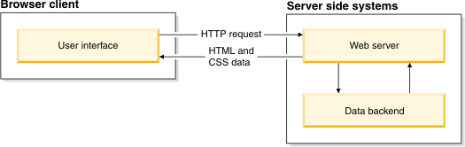
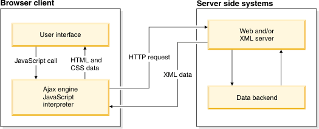

# MMWP2024 - Übungsserie 08 - Asynchrones Javascript

Lehrveranstaltung Multimediale Webprogrammierung   Wintersemester 2024/25

Link zum Kurs: https://bildungsportal.sachsen.de/opal/auth/RepositoryEntry/46557921282  
Zum Vertiefen der Kenntnisse: https://css-tricks.com/now-ever-might-not-need-jquery/

Hinweis: Nutzen Sie Ihr public_html für Aufgaben und Experimente, die einen Webserver notwendig machen.

### 1. Ajax (Asynchronous JavaScript and XML) fasst eine Kombination von Technologien zur asynchronen Kommunikation zwischen Browsern und Servern zusammen.

Zum Verständnis des Vorgangs machen Sie sich mit den folgenden Technologien vertraut:
* HTML
* HTTP
* DOM
* JavaScript
* XMLHttpRequest

Hinweis: Der Transport von Daten ist nicht auf das Format XML beschränkt. Plain text und JSON sind ebenfalls mit Ajax möglich.

Visualisierung des klassischen Web-Modells, bei dem ein Webserver HTTP requests beantwortet und HTML Seiten an den Client sendet. Dieser Prozess blockiert die Webpage für den User.

Visualisierung einer Ajax-basierten Applikation, bei der Daten asynchron (nicht blockierend) angefordert werden.

### 2. Experimentieren Sie mit diesem Beispiel.

Hinweis: Moderne Webbrowser verbieten den Zugriff auf lokale Dateien ohne Webserver. Legen Sie die Dateien, die Sie mittels der XMLHttpRequest aufrufen in Ihrem public_html ab. Ändern Sie die URL entsprechend.

Beispiel:

xhttp.open("GET", "https://www.imn.htwk-leipzig.de/~Username/ajax_info.txt", true);

### 3. Experimentieren Sie mit diesem Beispiel. Legen Sie den Fokus dabei neben der Verwendung von XMLHttpRequest auf die Arbeit mit XML und die Manipulation des DOM basierend auf den erhaltenen Daten.

Hinweis: Achten Sie auch hier auf die Verwendung Ihres public_html 	Verzeichnisses.

### 4. Betrachten Sie einige Anwendungszenarien für Ajax. Bspw. [hier](https://www.geeksforgeeks.org/what-are-ajax-applications-in-web-development/) und [hier](https://developer.mozilla.org/en-US/docs/Learn/JavaScript/Asynchronous/Implementing_a_promise-based_API).

### 5. Für weitere Informationen zu einer modernen Weiterentwicklung von Ajax informieren Sie sich zur Fetch API, mit der ebenfalls Daten effizient innerhalb einer Seite verändert werden können.

### 6. Informieren Sie sich zum Konzept Single-page application. Das Framework React dient bspw. zur Entwicklung von SPAs. Dabei wird eine Komponenten-basierte Architektur verwendet.

## Selbststudienzeit/Weitere Schritte:

Nutzen Sie die Tutorials für eine weitere Vertiefung: https://www.sitepoint.com/guide-vanilla-ajax-without-jquery/
